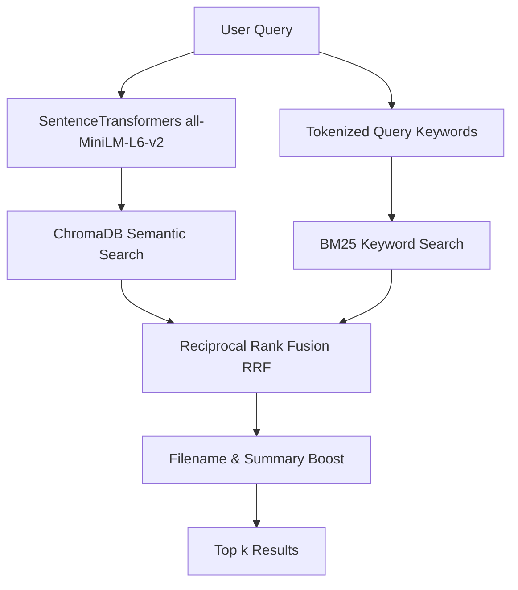
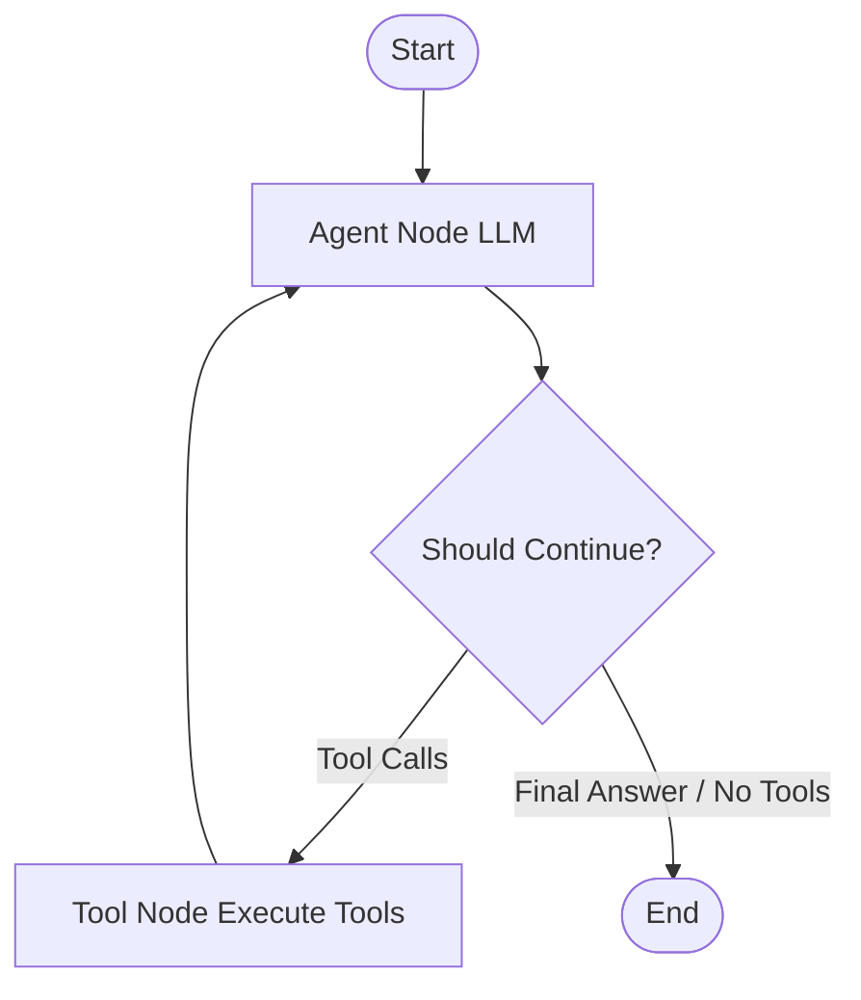
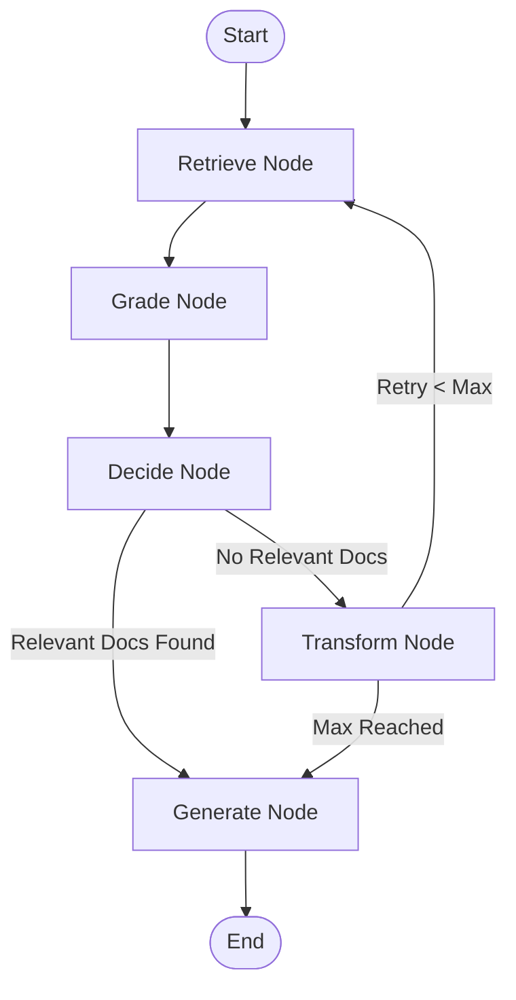

# FileGPT Interview Preparation Guide

This guide is designed to help you explain your Final Year Project (FYP), **FileGPT**, during your interview. It details how the system is built and highlights exactly how **LangChain** and **LangGraph** are integrated into its architecture.

---

## 1. Project Overview: What is FileGPT?

**FileGPT** is a local-first, privacy-preserving AI file management and research assistant. It is designed to run entirely on a user's local machine, indexing their local directory of documents and code files to allow conversational queries, semantic searches, and automated file organization.

### Key Use Case (Security & Research Focus)
The agent contains specific rules and heuristics tailored for cybersecurity labs (e.g., SEED Labs). It allows students or security researchers to safely analyze and summarize files related to vulnerabilities, exploits, and concepts such as **buffer overflows**, **SQL injections**, and **control hijacking** without uploading sensitive code to third-party APIs.

### The Technology Stack
*   **Frontend**: React (hosted inside a Tauri desktop shell).
*   **Desktop Shell**: Tauri (Rust-based container providing local filesystem access and window controls).
*   **Backend**: FastAPI (Python) handles API requests and runs background workers.
*   **Database/Storage**: SQLite + JSON metadata database.
*   **Inference Engine**: Ollama (runs local language models like `qwen2.5:1.5b` or `qwen2.5:0.5b`).
*   **Vector Database**: ChromaDB (stores embeddings created using the SentenceTransformers `all-MiniLM-L6-v2` model).
*   **Keyword Search**: BM25 (using `rank_bm25`).

---

## 2. The Core Retrieval Pipeline: Hybrid RAG Search

Before diving into LangChain/LangGraph, it is crucial to explain how search works in FileGPT. To prevent hallucinations and improve precision, FileGPT uses a **Hybrid Retrieval-Augmented Generation (RAG)** pipeline:

1.  **Semantic Search**: ChromaDB retrieves chunks matching the query embedding.
2.  **Keyword Search**: BM25Okapi retrieves chunks matching tokenized query keywords.
3.  **Reciprocal Rank Fusion (RRF)**: Merges results from both methods based on their relative ranks:
    $$\text{RRF Score} = \sum_{m \in M} \frac{1}{60 + r_m(d)}$$
4.  **Metadata Boost**: Adds score boosts if the query keywords appear directly in the filename or pre-generated file summary.

---

## 3. How LangChain is Used

LangChain serves as the wrapper for your LLMs, structured outputs, and agent tools.

### A. Intent Routing (`router_service.py`)
To prevent invoking heavy agent reasoning loops for simple queries, FileGPT uses a **LangChain Intent Router** to classify the user's input:
*   **Single/Multi-Intent Classification**: Uses `ChatOllama` with Pydantic structured outputs (`with_structured_output`) to map queries to schemas:
    *   `SearchIntent`: Finding files or asking about content.
    *   `ActionIntent`: File system operations (move, copy, organize).
    *   `ChatIntent`: General conversation.
    *   `MultiIntent`: Compound tasks (e.g., *"Find expense.xlsx and summarize it"*).
*   **Fast-Path Heuristics**: If the query matches explicit file search commands (e.g., *"find the C++ file"*), it bypasses the LLM entirely and runs a deterministic regex/keyword search for immediate speed.

### B. Tool Definitions (`tools.py`)
FileGPT uses LangChain's `@tool` decorator to define filesystem capabilities that can be invoked by the LLM:
*   `search_files`: Semantic + keyword search.
*   `read_file`: Reads up to 8,000 characters of a file.
*   `list_directory`: Lists files/folders with size details.
*   `copy_file`/`move_file`: Manages files/folders.
*   `organize_files`: Automatically categorizes files using the AI-Powered `categorization_service`.

---

## 4. How LangGraph is Used

FileGPT uses LangGraph to define and execute two distinct, complex workflows:
1.  **An Autonomous ReAct Agent** for interactive tool use and file operations.
2.  **A Self-Correcting RAG Workflow** to handle user questions with query refinement.

### Graph A: The ReAct Agent (`agent_service.py`)
When the router detects an `AGENT` or file-system-bound query, it invokes the ReAct agent graph. This implements a cycle of **Action $\rightarrow$ Observation $\rightarrow$ Action**.

*   **State**: The agent state is defined as `AgentState` containing a list of `BaseMessage` objects, accumulating the conversation history.
*   **Agent Node**: Binds the LangChain tools to the Ollama model using `llm.bind_tools(tools)` and invokes the model.
*   **Tool Node**: Executes the tool calls generated by the LLM and feeds the output back into the graph state as `ToolMessage`s.
*   **Conditional Edges**: Inspects the last message. If the LLM output contains `tool_calls`, it routes to the `tools` node; otherwise, it ends and presents the final answer.
*   **Fallback**: If the local model does not support native tool calling (e.g., `qwen2.5:0.5b`), the service falls back to a deterministic keyword-based router.

### Graph B: Self-Correcting RAG (`rag_workflow.py`)
For question answering, FileGPT implements the **Self-Correcting RAG** pattern (Retrieve $\rightarrow$ Grade $\rightarrow$ Decide $\rightarrow$ Transform $\rightarrow$ Generate) to prevent semantic drift.

*   **Retrieve Node**: Queries the Hybrid Search Engine.
*   **Grade Node (`rag_grader.py`)**: Uses an LLM to grade retrieved documents as `RELEVANT` or `NOT_RELEVANT` relative to the query. This removes irrelevant chunks (semantic drift) before generation.
*   **Decide Node**: Evaluates the graded documents. If relevant documents survive, it routes to `Generate`. If zero relevant documents survive, it routes to `Transform`.
*   **Transform Node (`rag_query_transformer.py`)**: Re-writes/optimizes the query to be more search-friendly (e.g., *"find the sorting thing"* $\rightarrow$ *"merge sort algorithm C++"*), increments the attempt counter, and loops back to `Retrieve`.
*   **Generate Node**: Builds context using only the graded (relevant) documents and generates a concise answer citing sources.

---

## 5. Potential Interview Questions & Answers

### Q1: Why did you use LangGraph instead of standard LangChain?
> **Answer**: *"Standard LangChain works well for linear chains, but is not designed for cyclic agent workflows. LangGraph allowed me to represent agent loops as a StateGraph with nodes and conditional edges. This gave me precise control over state management (maintaining message history) and allowed me to build cyclic, self-correcting logic (like retrying searches with transformed queries if the initial search returned no relevant documents) which is very hard to build in standard LangChain."*

### Q2: How does the Self-Correcting RAG workflow handle bad search queries?
> **Answer**: *"If a user inputs a vague query, the initial search returns irrelevant files. In the Grade node, the LLM flags all these files as `NOT_RELEVANT`. The Decide node detects that zero documents are relevant and routes the state to the Transform node. The LLM then re-writes the query to add specific search keywords, loops back to the Retrieve node, and performs a fresh search. We allow up to 3 attempts to find relevant documents before generating a fallback answer."*

### Q3: How do you handle local LLM limitations (e.g., no tool calling, slow execution)?
> **Answer**: *"Running models locally (like Qwen 1.5B/0.5B via Ollama) poses two main challenges: speed and capability. To address this, I implemented: 1. A **Fast-Path router** using regex/keyword matching to handle simple searches instantly without querying the LLM. 2. A **Fallback router** in case the active local model does not support tool calling. 3. **Batching** in our Document Grader to evaluate multiple documents in a single LLM request, reducing model overhead."*
